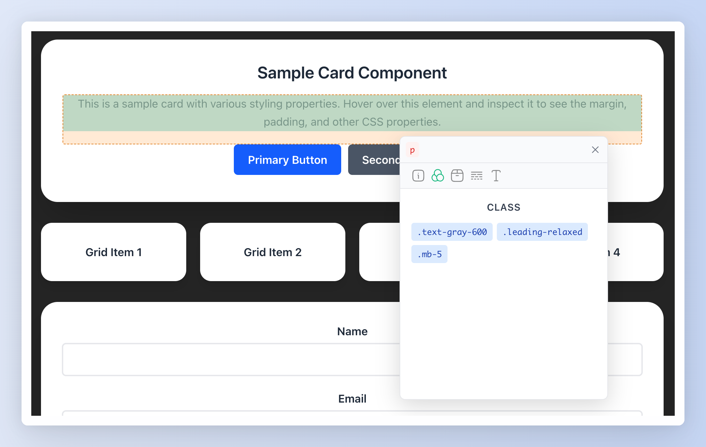

# UnoCSS Inspector (WIP) [](https://app.netlify.com/projects/unocss-inspector/deploys)

A UnoCSS-optimized element inspection tool, similar to browser developer tools' element inspector, for visual analysis of web element styles, box models, and property information.

<p align="center">
  
</p>

## 🎨 Features

- **⚡ UnoCSS Optimized**: Designed specifically for UnoCSS atomic CSS framework with perfect atomic class inspection support
- **🎯 Element Selection**: Browser DevTools-like element selector, click any page element for inspection
- **📦 Box Model Visualization**: Real-time display of element's margin, border, padding, content layers
- **🔍 Detailed Info Panel**: View element's basic info, CSS classes, box model data, style properties, and text content
- **🖱️ Mouse Following**: Info panel intelligently follows mouse movement, draggable after selection
- **🎨 Highlighting**: Colorful box model highlighting when selecting elements for intuitive structure display
- **📱 Responsive Sync**: Automatic synchronization of highlighting and info panel when window resizes or page scrolls
- **🏷️ Style Analysis**: Distinguish between inline and computed styles, prioritize inline styles for atomic class debugging

## Installation

```bash
npm install unocss-inspector
# or
pnpm add unocss-inspector
# or
yarn add unocss-inspector
```

## Usage

### As Vue Plugin

```ts
import UnocssInspector from 'unocss-inspector'
import { createApp } from 'vue'

const app = createApp()
app.use(UnocssInspector)
```

### Import Individual Component

```vue
<script setup lang="ts">
import { Inspector } from 'unocss-inspector'
</script>

<template>
  <div>
    <!-- Your app content -->
    <div class="my-content">
      Hello World
    </div>

    <!-- Add inspector component -->
    <Inspector v-model="selectedElement" @element-selected="onElementSelected" />
  </div>
</template>
```

## License

MIT © [Chris](https://github.com/zyyv)
